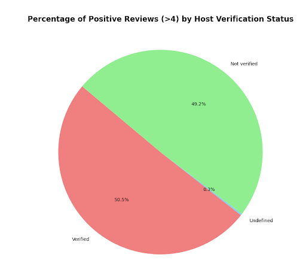
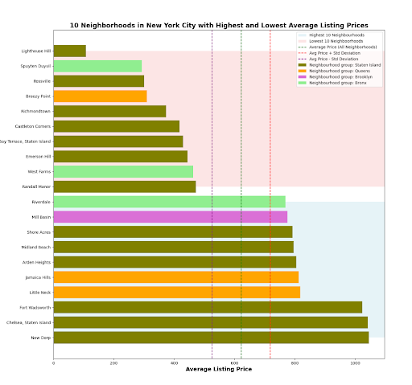
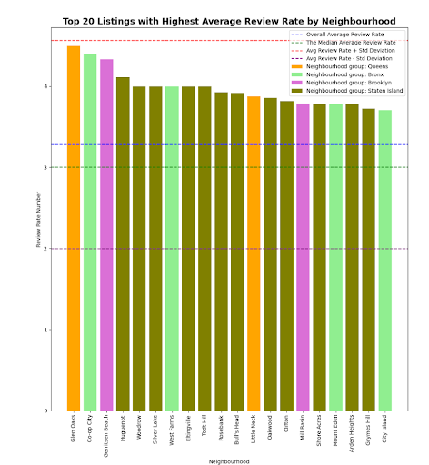
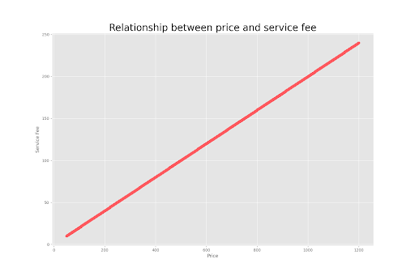

## Business-programming-TEC de Monterrey 2023

# Problem situation: Airbnb Open Data

###  Team Name: NEW YORK
* Mathieu LE TREUST A01762505
* Petra KOHLER A01762430
* Hanna KRÖLL A01762270
* Miguel Angel Pérez Rios A01751379

# How To Run

## Install all the needed dependencies:

* from CTkMessagebox import CTkMessagebox  # Importe une boîte de dialogue personnalisée
* import customtkinter as ctk  # Importe le module customtkinter pour créer l'interface graphique
* import os  # Importe le module os pour exécuter un autre script Python
* import pandas as pd
* import matplotlib.pyplot as plt
* from tkinter import PhotoImage
* from matplotlib.backends.backend_tkagg import FigureCanvasTkAgg
* from PIL import Image

## How to run the program
    
**Run the file fenetre1.py** 
    
then insert the correct password = TC1027
and select the first questions

# Description

### Objective

We have chosen our dataset from the Kaggle website (https://www.kaggle.com), adhering to the following criteria: the dataset should have a minimum of 5 columns with quantitative data and 5 columns with qualitative data. Furthermore, the data should be related to an organization or a family business.

### Dataset Description

The chosen dataset is accessible at the following link: https://www.kaggle.com/datasets/arianazmoudeh/airbnbopendata

This dataset pertains to the use of Airbnb since 2008, where both guests and hosts have used the platform to travel in a more unique and personalized manner. As part of the "Airbnb Inside" initiative, this dataset describes the listing activity of homestays in New York City. It has a size of 35.91 MB and is downloadable in CSV format. The author of this dataset is Arian Azmoudeh. There are 102599 lines.

In total, this dataset (.csv) comprises 26 columns.

### Main Questions
The analysis of the Airbnb dataset in New York City has shown several key insights that can be used to improve or change business strategies for the platform. Here are the conclusions drawn from the data:
#### 1. Do hosts with verified identities receive more positive reviews compared to hosts without verified identities?:

The data indicates that hosts with verified identities do not significantly outperform hosts without verification in terms of receiving positive reviews (above 4). The distribution of positive reviews is almost evenly split, with 50.5% belonging to verified hosts and 49.2% to unverified hosts. This suggests that host identity verification alone may not be the sole determinant of guest satisfaction.
#### 2. Which neighborhoods in New York City have the highest and lowest average listing prices?

The analysis of average listing prices across New York City neighborhoods highlights significant disparities. Neighborhoods such as New Drop, Chelsea Staten Island, and Fort Wadsworth exhibit the highest average prices, while Lighthouse Hill, Spuyten Duyvil, and Rosville offer more budget-friendly options. Understanding these price variations can be crucial in shaping pricing strategies and marketing efforts tailored to specific neighborhoods.
It’s interesting to see, that some neigbourhood groups (f.e.Staten Island) are represented as well in the top 10 of the lowest and the top 10 of the highest prices. Brooklyn seems to be the only neigbourhoodgroup that does not offer lower than the average listings.
#### 3. Which listings have the highest reviews? 

The analysis of reviews indicates that certain neighborhoods consistently receive higher average review rates, indicating potentially popular and highly-rated properties (f.e. Glen Oaks,Co-op City, Gerritsen Beach). This information is valuable for both hosts and guests, as it helps identify areas where guests have had consistently positive experiences. 
There seems to be no clear preference in specific neigbourhood groups. Only Staten Island might be considered in average higher rated.
#### 4. Is there a Correlation between price and service fee?

There's a positive correlation between listing price and service fee. As the price of a listing increases, the service fee tends to rise as well. This suggests a relationship between these two factors, which can inform pricing strategies.

### Recommendations
Based on these conclusions, here are proposed actions to enhance the Airbnb platform:

**Enhanced Host Education:**
Provide resources and education to hosts about strategies for maximizing guest satisfaction, even without formal identity verification. This can include tips on communication, cleanliness, and amenities.

**Highlighting High-Performing Neighborhoods:**
Feature neighborhoods with consistently high review rates to attract more guests and encourage hosts in those areas to maintain high-quality standards.
User-Friendly Verification Process:
Streamline and enhance the host verification process to encourage more hosts to participate. This could include clear benefits and incentives for hosts with verified identities.

**Tailored Marketing Campaigns:**
Design marketing campaigns that highlight the unique features and attractions of different neighborhoods, targeting both hosts and guests to create more interest in specific areas.

**Local Market Insights:**
Provide investors with detailed market insights for specific neighborhoods or areas of interest. This includes data on demand trends, average pricing, and occupancy rates. Customized reports can empower investors to make informed decisions.

**Price and Service Fee Optimization:**
Provide hosts with data-driven insights on pricing strategies and service fee structuring. Offer recommendations on competitive pricing while factoring in service fees to maximize revenue and guest satisfaction.

**Partnerships with Local Businesses in High-Review Areas:**
Collaborate with local businesses in neighborhoods known for high reviews. Offer joint promotions or exclusive deals to guests staying in those areas, creating added value for both hosts and guests.

By implementing these strategies, Airbnb can enhance the overall experience for both hosts and guests, ultimately driving greater satisfaction and reputation of the platform. Additionally, the platform can continue to grow and thrive by investing in the strengths and characteristics of different neighborhoods in New York City.

